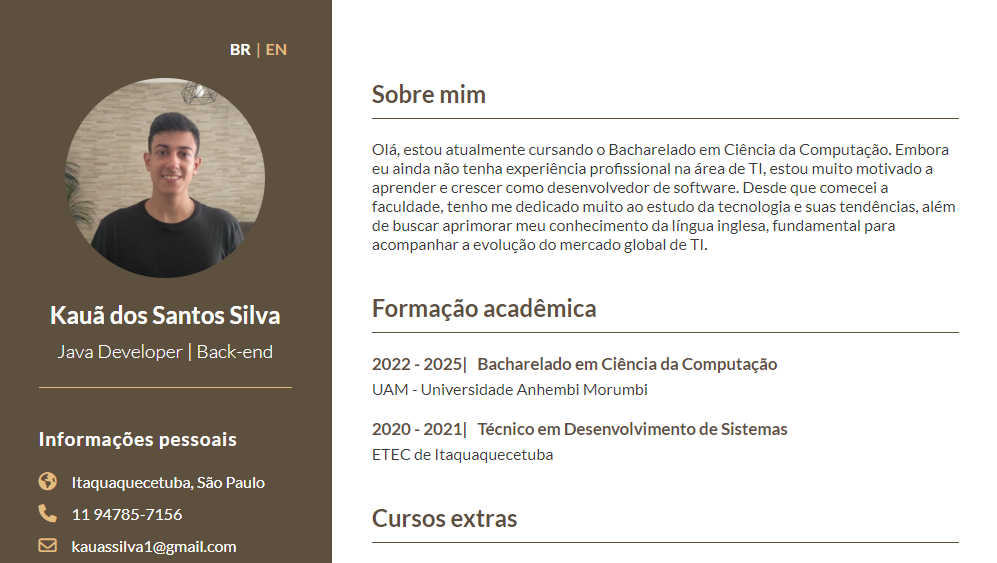

<h1 align="center"><a href="https://kauassilva.github.io/Curriculo-Web/" taget="_blank">Meu Currículo Web</h1>

Aplicação Web do meu currículo online. A página apresenta um design moderno e responsivo, com seções bem organizadas e informações detalhadas sobre quem sou, minhas habilidades técnicas, formação acadêmica, cursos extras e projetos pessoais. Além disso, a página inclui links para meu perfil do [GitHub](https://github.com/kauassilva) e [LinkedIn](https://www.linkedin.com/in/kaua-santos/). O site é intuitivo e fácil de navegar com a possibilidade de mudar o idioma caso queira ver o conteúdo em inglês.

## 🔨 Funcionalidades da aplicação

- `Seletor de idiomas`: é possível escolher o idioma da aplicação entre português e inglês, sendo o primeiro o idioma padrão. Para fazer a troca, em cima da foto do perfil, clique em "EN" para trocar para o inglês, ou "BR" para trocar para o português.
  
  | Português | Inglês |
  | --- | --- |
  |  |  |
  
- `Responsividade`: é possível ver o mesmo conteúdo de forma agradável sem afetar o conteúdo em si, em diferentes tamanhos de tela.
  | Largura <= 550px | Largura <= 950px | Largura > 950px |
  | --- | --- | --- |
  |  |  |  |

## 📁 Acesso ao currículo

Você pode acessar a página da aplicação por este link (https://kauassilva.github.io/Curriculo-Web/), ou clicar no título principal deste README

## ✅ Tecnologias utilizadas

- `HTML`
- `CSS`
- `JavaScript`
- `Visual Studio Code`
