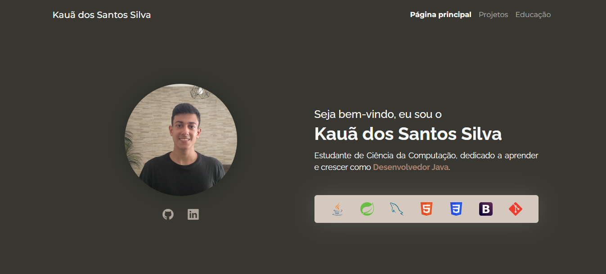
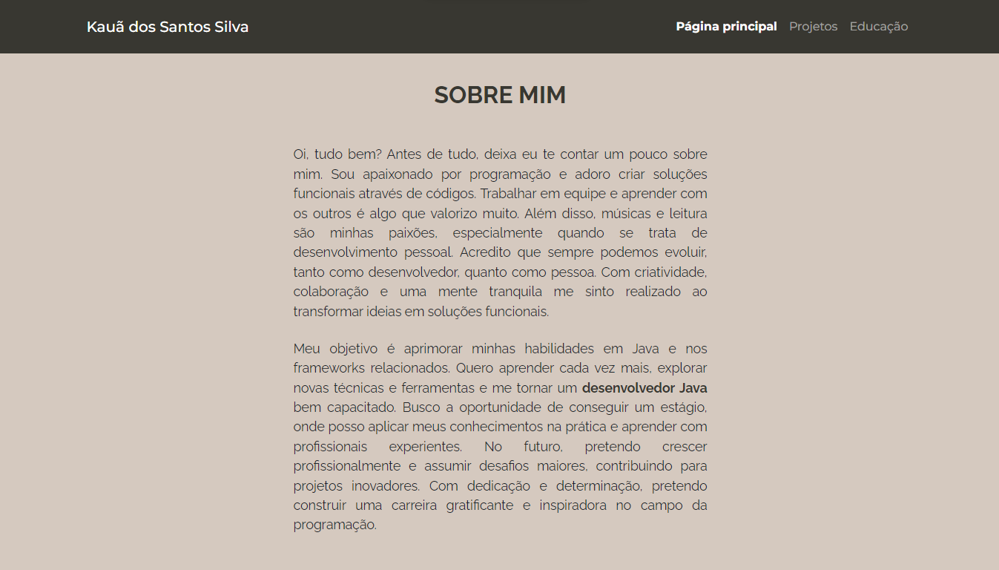
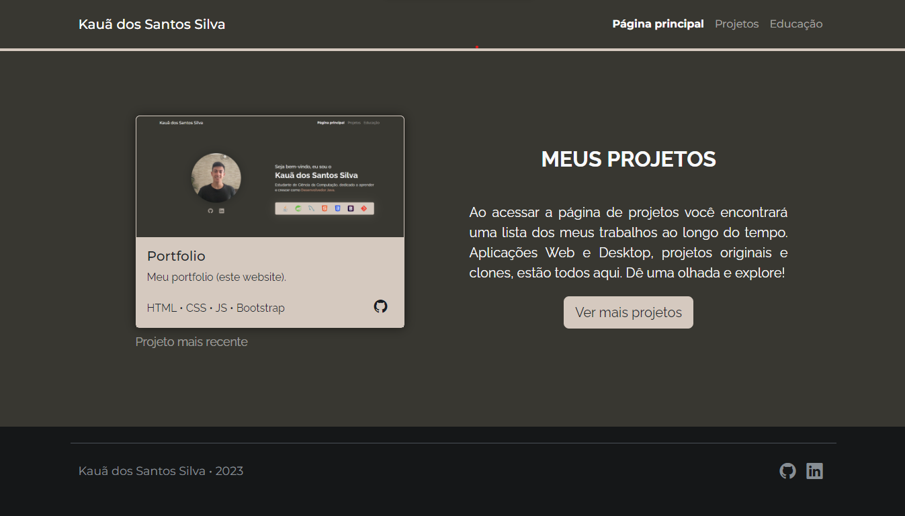
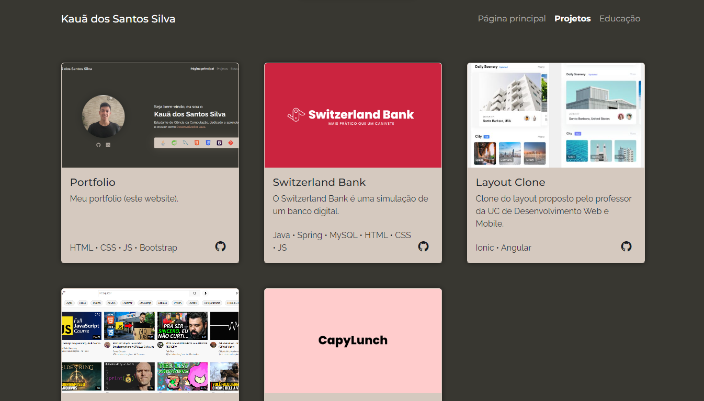
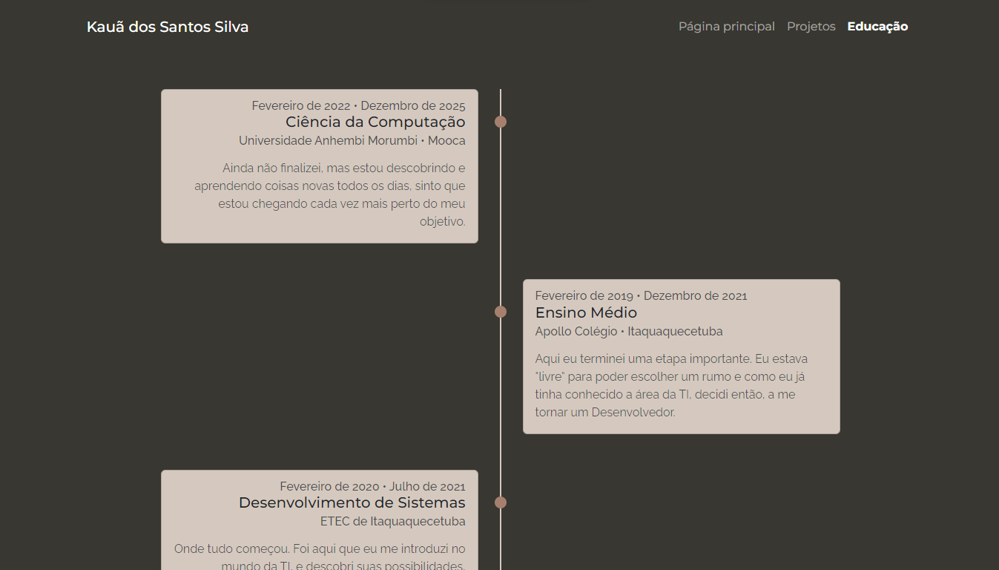
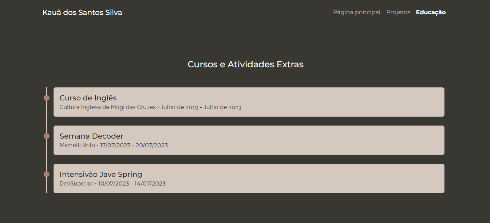

<h1 align="center"><a href="https://kauassilva.github.io/Portfolio/" target="_blank">Meu Portfólio Web</a></h1>

Bem-vindo ao meu portfólio web! Aqui você encontrará uma introdução sobre mim, uma coleção dos meus projetos e minha educação. Meu objetivo é demonstrar minhas habilidades de desenvolvimento e ser um "portal" para apresentar meus projetos.

## ⚙️ Tecnologias Utilizadas
* HTML
* CSS
* JavaScript
* Bootstrap

## 🗂️ O Portfólio

### [Página Principal](https://kauassilva.github.io/Portfolio/)

Está é a primeira seção que aparece quando você entra no site. Nela, é possível ver uma barra de navegação com o link de todas as páginas, uma foto minha, minhas redes sociais com seus respectivos links, meu nome, meu objetivo e as linguagens que possuo conhecimento.
Obs.: ao passar o mouse em cima das linguagens e das redes sociais, você verá uma animação simples.

Descendo um pouco a página, verá uma seção "Sobre Mim", onde possui dois parágrafos que falam um pouco mais de quem eu sou, do que gosto, e de meu objetivo.

Descendo até o fim da página, verá a última seção "Meus Projetos", que introduz a página de Projetos e mostra o meu projeto mais recente. Além de, encerrar a página com um rodapé que mostra o meu nome, o ano da última atualização, e os links para minhas redes sociais.

### [Página de Projetos](https://kauassilva.github.io/Portfolio/pages/project.html)

Está página serve para eu apresentar os meus projetos mais relevantes em formato de <em>card</em>, onde mostro uma imagem do projeto, seu título, uma breve descrição, tecnologias usadas e um link para o repositório GitHub do respectivo projeto. Além disso, a página possui também, uma barra de navegação e um rodapé.

### [Página de Educação](https://kauassilva.github.io/Portfolio/pages/education.html)

No começo dessa página, eu apresento em formato de <em>timeline</em>, minha formação acadêmica e uma descrição de como ela foi ou é importante pra mim.

E mais abaixo, tem uma seção de cursos e atividades extras, que mostra inicialmente os três mais recentes e ao apertar o botão ele exibe mais três, e assim por adiante.

Descendo até o fim da página, tem uma seção de certificados que possuo, que mostra inicialmente os três mais recentes e ao apertar o botão ele exibe mais três, e assim por adiante.

 

Sinta-se à vontade para explorar meus projetos e obrigado por visitar meu portfólio!

